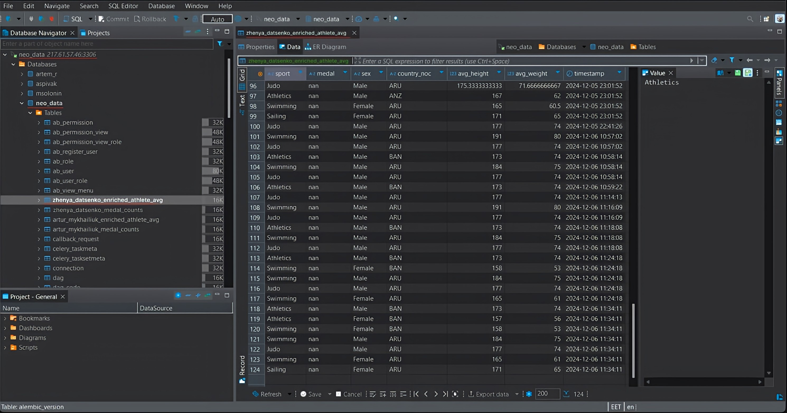
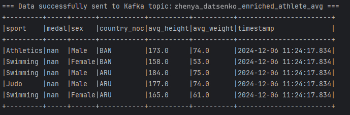
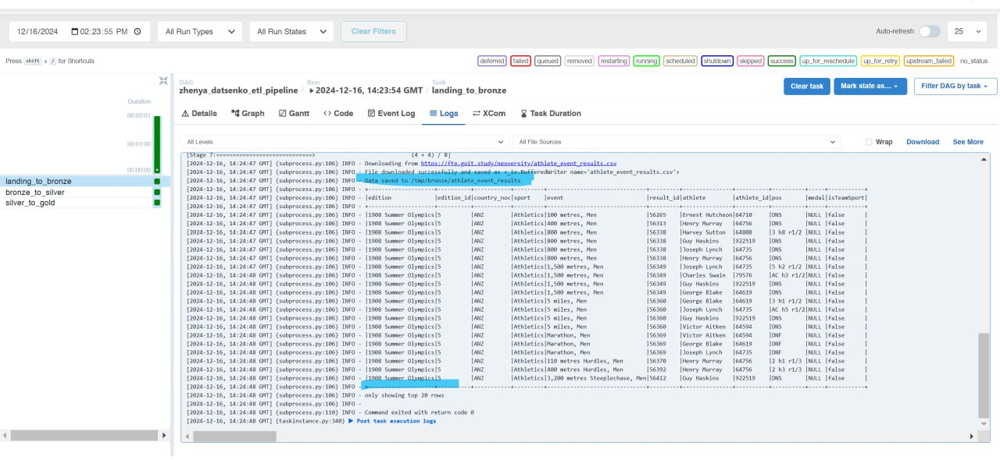
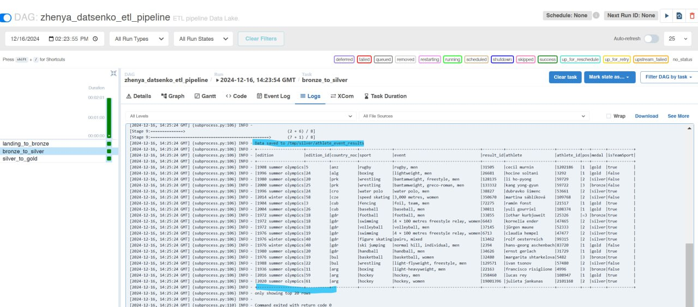
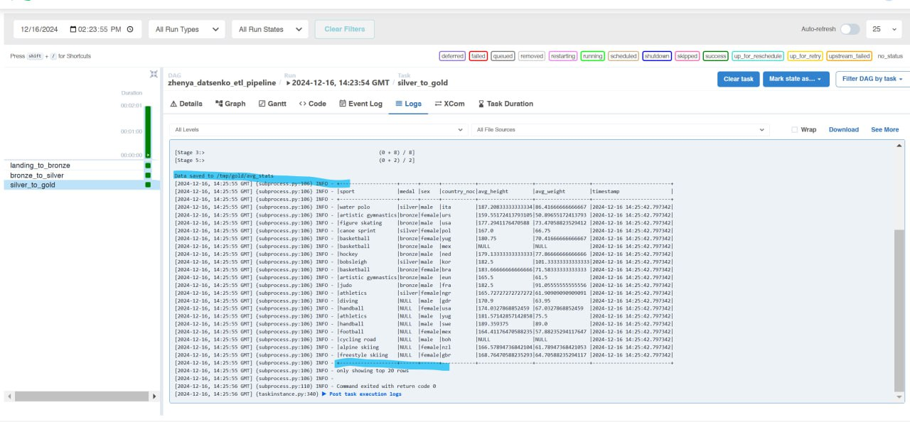
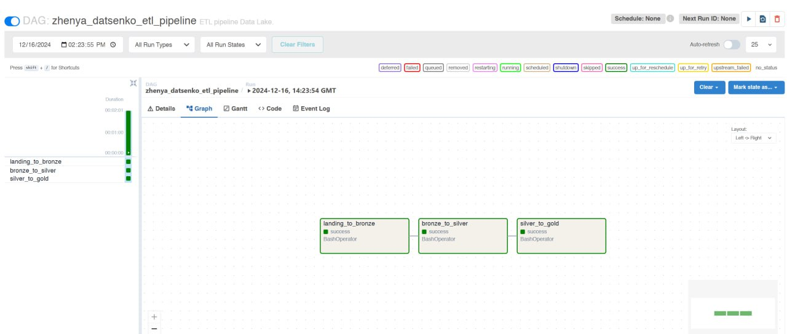

# Final Project for the Data Engeneering Course

## Part 1: Building an End-to-End Streaming Pipeline

### Step-by-Step Instructions

You work at a betting company. One of your tasks is to generate data for ML models. Some of the features include the average height, average weight, gender, and country of origin of athletes.

Models are trained separately for each sport. Data on medal presence in an event is used as a target (output) for the ML model.

The company wants to adjust betting odds as quickly as possible, so you are tasked with designing a streaming solution. Physical data of athletes is pre-known and stored in a MySQL database. Competition results, on the other hand, are provided via a Kafka topic.

### Your Tasks:

1. Read the physical data of athletes using Spark from the MySQL table `olympic_dataset.athlete_bio` (the database and its credentials will be provided).
2. Filter out rows where height and weight are empty or non-numeric. This can be done at any stage of your program.

3. Read competition results from the Kafka topic `athlete_event_results`. Transform the JSON data into a dataframe format, where each JSON field becomes a separate column.

4. Join the competition results from the Kafka topic with the physical data from the MySQL table using the key `athlete_id`.

5. Calculate the average height and weight of athletes individually for each sport, medal type (or its absence), gender, and country (`country_noc`). Add a timestamp indicating when the calculations were performed.

6. Stream the data (using the `forEachBatch` function) into:
   - (a) the output Kafka topic,
   - (b) the database.
     ...

### Acceptance and Evaluation Criteria

- The code runs and produces the desired result.
- Screenshots are provided to demonstrate the code's results either via console output or in the database.
- For full task completion, screenshots of only the database and Kafka topic output are required (no intermediate steps needed).
- The code must include comments marking where each task step is implemented, e.g., `# Step 6.a): Writing to output Kafka topic`.
  ☝🏻 Acceptance criteria for the final project are mandatory for mentor evaluation. If any criteria are not met, the mentor will return the task for revision without evaluation. If you need clarification or are stuck, contact your mentor in Slack.

---

## Part 2: Building an End-to-End Batch Data Lake

### Step-by-Step Instructions

👉🏻 Task overview: In this part of the project, you will create a simple multi-hop data lake using data processing tools such as Spark to organize ETL processes (Extract, Transform, Load).

The task resembles the first part of the final project but focuses on batch data, which is critical for any data engineering system.

You will work with the already familiar athlete and sports result data. These are the `athlete_bio` and `athlete_event_results` tables available on the FTP server at:

- `https://ftp.goit.study/neoversity/athlete_bio.txt`
- `https://ftp.goit.study/neoversity/athlete_event_results.txt`.

The main objective is to build a three-tier data processing architecture: from initial storage (landing zone) through processed and cleaned data (bronze/silver) to the final analytical dataset (gold).

### Your Tasks:

1. Write the file `landing_to_bronze.py` to:

   - Download the CSV file from the FTP server.
   - Read the CSV file using Spark and save it in Parquet format in the folder `bronze/{table}`, where `{table}` is the table name.

2. Write the file `bronze_to_silver.py` to:

   - Read the `bronze` table.
   - Apply text cleaning functions to all text columns.
   - Deduplicate rows.
   - Save the table in the folder `silver/{table}`, where `{table}` is the table name.

3. Write the file `silver_to_gold.py` to:

   - Read the `silver/athlete_bio` and `silver/athlete_event_results` tables.
   - Perform a join on the column `athlete_id`.
   - For each combination of `sport`, `medal`, `sex`, and `country_noc`, calculate the average `weight` and `height`.
   - Add a `timestamp` column indicating when the program was run.
   - Save the data in `gold/avg_stats`.

4. Write the file `project_solution.py` to contain an Airflow DAG that sequentially executes all three files.

### Acceptance and Evaluation Criteria

- The code runs and produces the desired result.
- Screenshots are provided to demonstrate the code's results (screenshots of output tables and the DAG graph are required).

☝🏻 Acceptance criteria for the final project are mandatory for mentor evaluation. If any criteria are not met, the mentor will return the task for revision without evaluation. If you need clarification or are stuck, contact your mentor in Slack.

---

## Final Project Submission Instructions

1. Create a public repository `goit-de-fp`.

2. Complete both parts of the project and upload the code files and screenshots of the results into your repository.

💡 **For Part 1**: If all tasks are completed, only screenshots of the database and Kafka topic output are required (no intermediate steps needed).

💡 **For Part 2**: Display the final DataFrame for each Spark job using the command `df.show()`, where `df` is your DataFrame. The results will appear in the logs of the corresponding runs and task runs.

To access them, click on the task run icon (highlighted in red on the left) and then on Logs (highlighted in red on the right).

Scroll down to the moment where the DataFrame output is displayed on the screen. Take a screenshot, ensuring the timestamp column (blue rectangle on the left) is visible.

Take one screenshot of the output for any table for each Spark job. You should have three screenshots in total. Also, take a screenshot of the completed DAG graph.

3. Create a single archive containing all the code files and a text document with screenshots, then attach it to the LMS. The archive name should follow the format `FP_LastName`.

4. Attach the link to the `goit-de-fp` repository and submit it for review.

---

# TASK RESULTS

## Part 1 | Building an End-to-End Streaming Pipeline

### - Writing Data to MySQL Table

### - Writing Data to Kafka Topic

## Part 2 | Building an Batch Data Lake

### - Writing Data to the Bronze Table bronze/athlete_event_results

### - Writing Data to the Silver Table silver/athlete_event_results

### - Writing Data to the Gold Table gold/avg_stats

### - DAG with Three Completed Tasks

